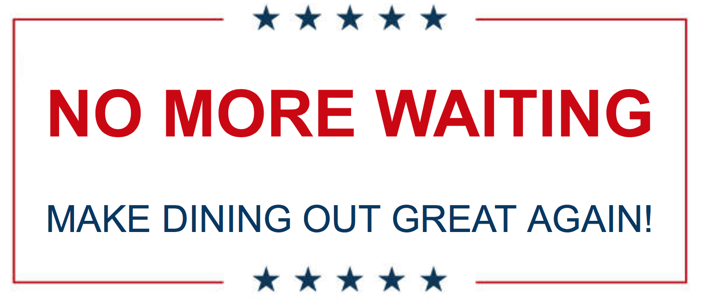
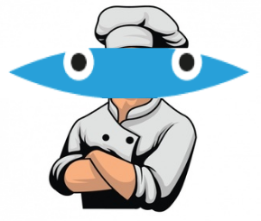
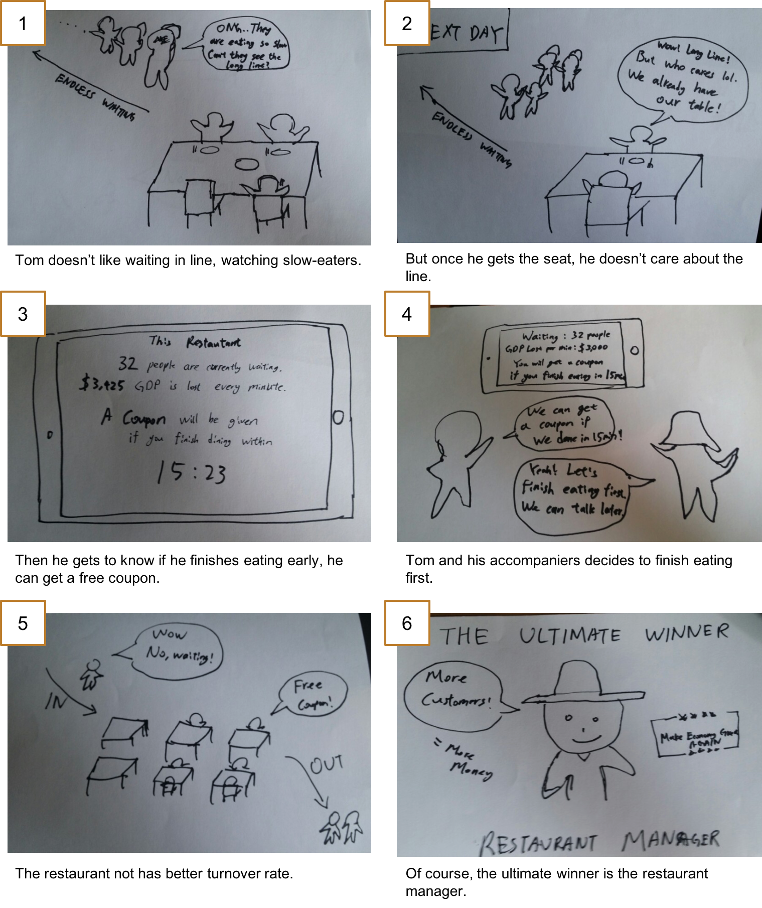
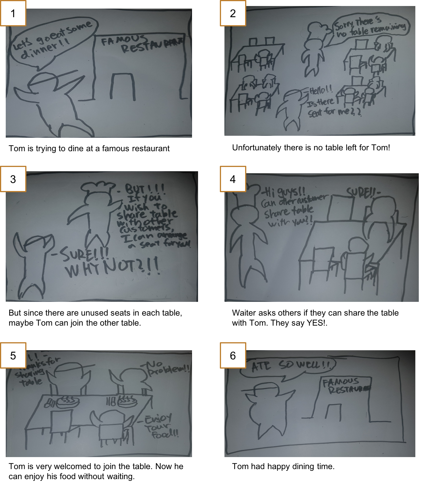
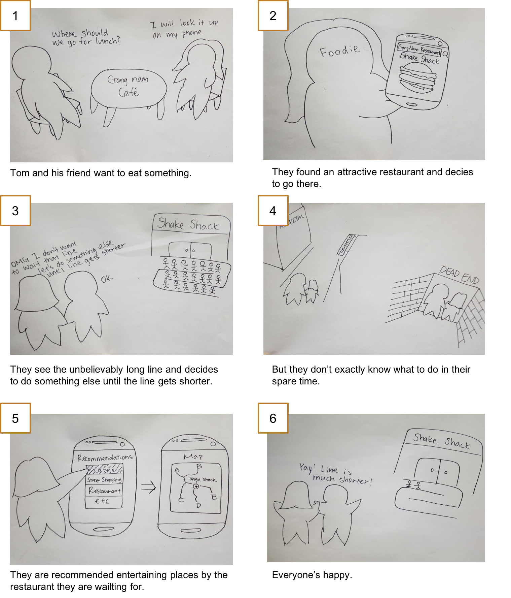

**CS374 Design Project 2: Ideation**  
**Team JEONSSA**  
20111016 Min Kang  
20121059 SunJae Lee  
20121061 Joon Young Lee  
20121087 Sewon Hong

---

# Ideation
 
 
---
 
## Point of view
We met a restaurant owner.  
We were amazed to realize that one out of two customers leave because of waiting.  
We thought that it would be game-changing to drastically reduce the time his customers had to wait.

---

## Persona
 
 
* **Age:** 42
* **Occupation:** Restaurant Owner
* **Status:** Married
* **Location:** Gangnam, Korea
* **Beliefs:** Providing the best food and service to customers is the only way to succeed (as a restaurant owner).
* **Motivation:** Providing his customers good food and service
* **Goals:** Wants to continually expand business, end goal of eventually becoming a franchised restauranteur

### Nubjjugi’s story:
* Nubjjugi is a 42 year-old restaurant owner
* His restaurant is in the busy area of Gangnam, usually always full during peak hours (lunch and dinner)
* Many customers have to wait to dine at his restaurant. 
* His restaurant has limited space available in dining area
* Loses lots of potential business because one of two customers get tired of waiting, and leave
* Feels bad not being able to provide optimal service
* He wants to minimize the number of waiting customers, so that he can reduce the loss of potential business, and have the opportunity to service them well

### Nubjjugi’s Goals:
1) Reduce customers’ waiting time
2) Serve as many customers as possible
3) Be able to provide all his customers with the best service
 
--- 
 
## How Might We...
1. ...encourage customers to eat faster?
2. ...make use of all available tables (dining space)?
3. ...make customers' waiting time more productive?
4. ...provide estimated waiting time for customers?
5. ...keep track of waiting customers?
6. ...manage no-shows, (and distribute their seats to waiting customers)?
7. ...reduce the waiting time?
8. ...serve food faster?
9. ...prevent customers from going to other restaurants?
10. ...entertain or (in some way) satisfy the waiting customers?

### Top 3 HMW
Selection Process: We selected top 3 by. 
#### How might we...   
1. ...encourage customers to eat faster?  
2. ...make use of all available tables (dining space)?  
3. ...make customers' waiting time more productive?  

---

## Solution Ideas

### Encourage faster eating
1. Make slow eaters pay more
2. Enforce a time limit on eating  
3. Give discounts to fast eaters
4. Give coupons to fast eaters
5. Give desserts to fast eaters
6. Give slow eaters less food
7. Have menu prices that vary depending on time of day (expensive during peak hours, cheaper when business is slow)
8. Forbid customers from doing other things besides eating
9. Customers can only sit at tables once their food is ready
10. Create a competitive environment to encourage fast eating

### Make use of space
1. Remove tables completely (customers will eat sitting on the floor)
2. Let customers eat while standing
3. Make use of a food truck in peak hours
4. Let customers share the same table
5. Move the kitchen to another floor or other building (to make for more room)
6. Implement take-outs
7. Implement a food delivery system
8. Set up tables outside the restaurant
9. Customers can only sit at tables once their food is ready
10. Renovate restaurant to make for more room

### Productive waiting time
1. Remove waiting time completely
2. Give a discount depending on how long the customer had to wait
3. Customers prepare their own food
4. Give incentives if the customer had to wait too long
5. Give a discount for next time when customer doesn’t get due to waiting
6. advertise restaurant on sns and get free food
7. Recommend other restaurants to go to
8. The customers prep food ingredients for their meals
9. Provide entertainment(e.g. a movie, TV, etc.) to waiting customers
10. Arrange a partnership with a nearby entertainment venue. (e.g, coffee shop, PC cafe, Karaoke)

---

## Top 3 Solutions  
Selection Process: Ideation on each HMW questions. Then we voted for the best. 
### Solution 1: Give Incentives to Fast Eaters
Why? Better than giving disadvantage to slow eaters.  

### Solution 2: Share Table
Why? This solution is very practical, and costs nothing. Very high effeciency.  

### Solution 3: Recommend Entertainment
Why? People visiting restaurants in an unfamiliar region don’t have info, so reduce the time searching for info and get right into entertainment so reduce the time searching for info and get right into entertainment

---

## Storyboards
### Storyboard 1
 
 
 
### Storyboard 2
 
 
 
 ### Storyboard 3
 
 
 ---
 
 ## Studio Reflections
 ### FEEDBACK SUMMARY
1) If the customers come as a group of 3, they wouldn't want to share the remaining spot with a random person. In a similar sense, a random customer would not be willing to join a group of random people. 
2) It would be nice to provide actual, accurate remaining waiting time
3) If the customer goes to recommended entertainment venues, customer could return early or late, resulting in either the customer waiting more, or the restaurant holding an empty table

### FEEDBACK REFLECTION
1) We will let customers join table only if they wish to, so that the customers won't feel forced to do so. Our understanding is that there are situations where customers must eat within a time constraint and thus don't mind eating with other people.
2) It is hard to estimate accurate remaining waiting time because people have different paces at which they eat, so we will provide the number of remaining waiting teams as an alternative measure
3) This problem could be handled by providing the customer exact remaining waiting time, but as already mentioned in the previous point, it is hard to do so for the reasons as explained. So the restaurant could recommend the customer to come back when a certain number of waiting teams are remaining.
