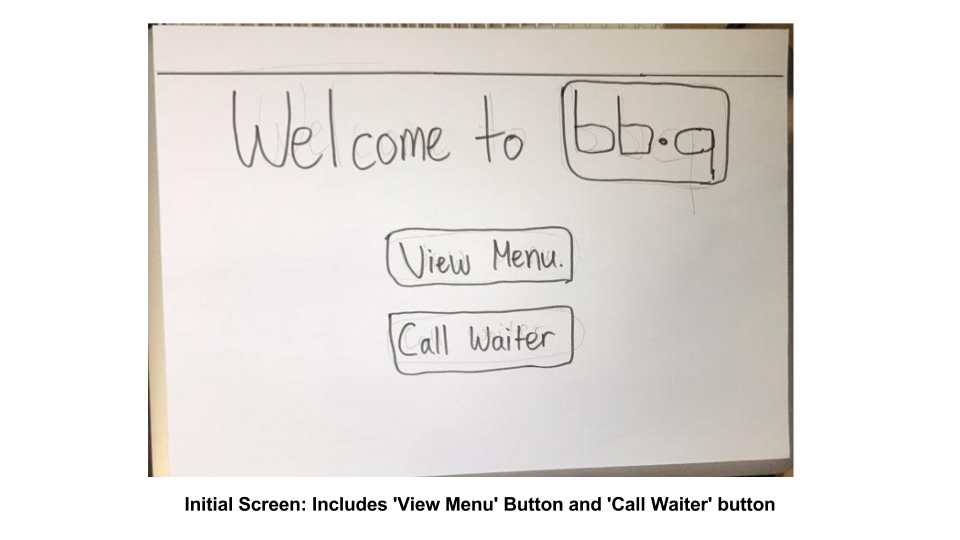

**CS374 Design Project 3: Paper Prototyping**  
**Team JEONSSA**  
20111016 Min Kang  
20121059 SunJae Lee  
20121061 Joon Young Lee  
20121087 Sewon Hong

---

# Paper Prototyping
 
 
---
## Prototype
### Initial Screen
 
 
 

### Surprise Offer Pop-up
 
##### Decline Offer
 
 
##### Accept Offer
###### Accept mission

###### Decline mission

---
## Participants

We presented our prototype to total three participants. 

###### KAIST undergraduate Student
* age: 23
* sex: male
* description: He is a KAIST undergraduate student who often goes out to eat with his girlfirend. Both he and his girlfriend is well known foodie, and has lots of experience waiting in a restaurant

###### KAIST SNU grad student
* age: 25
* sex: male
* description: He is a SNU graduate student who lives in very busy area around SNU. He hates waiting in a restaurant, and has has hard time finding restaurant that doesn't requires waiting.

###### OWNER of restaurant at Gangnam.
* age: 43
* sex: male
* description: He is a chief and a owner of a restaurant in a very busy area in Gangnam. He is very concerned about lossing potential users because of waiting time. 
---
## Briefing
  We presented a prototype of an interface of an touchscreen at a restaurant table, on which a prompt would show, notifying customers that they had a chance to win a special offer. The purpose of the presentation is to see whether the customer is willing to do certain tasks, such as eating faster, provided some incentive.

  The presentation was done after some micro-iteration with the feeback given by other peers in the class. The background behind this prototype is that direct request to eat faster can be intrusive. Direct request can undermine the overall dining experience. So we’ve tried to circumvent this potential intrusion by using the roulette, the wheel-of-fortune. Customer is expected to get the feeling as if they have done some work to get the incentive for their own good.
  
---
## Tasks
---
## Observation
---
## Individual Reflection

#### SunJae Lee

#### Min Kang

#### Joon Young Lee

#### Sewon Hong

---
## Studio Reflections
### FEEDBACK SUMMARY
1) Add more games besides virtual roulette.
2) include other prizes besides discount.
3) Add elements from other storyboards into virtural roulette such as sharing table.

### FEEDBACK REFLECTION
