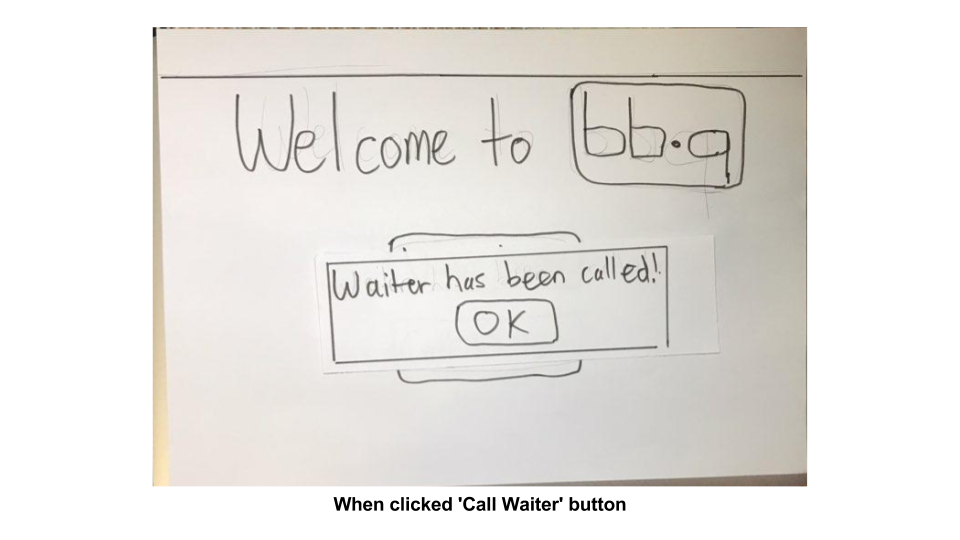
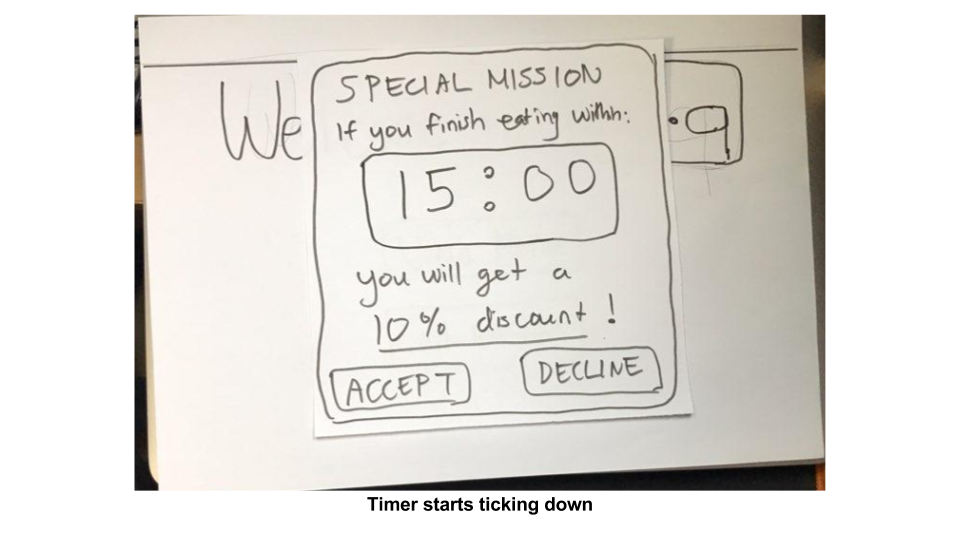
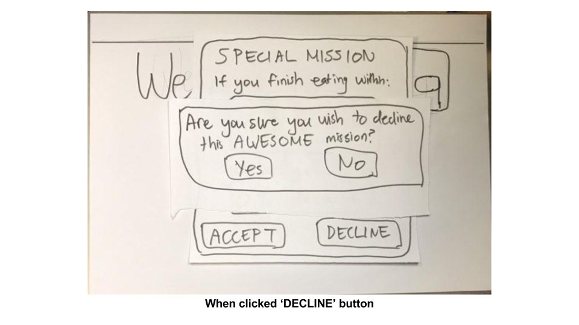
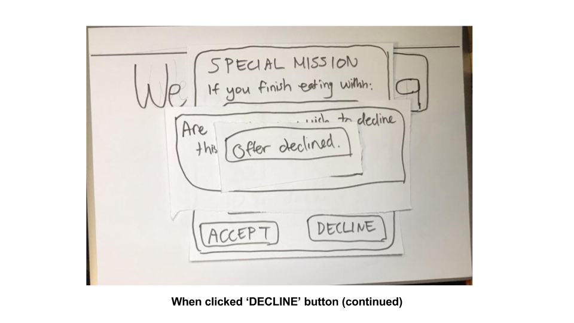

**CS374 Design Project 3: Paper Prototyping**  
**Team JEONSSA**  
20111016 Min Kang  
20121059 SunJae Lee  
20121061 Joon Young Lee  
20121087 Sewon Hong

---

# Paper Prototyping
 
 
---
## Prototype
### Initial Screen
 
 
 

### Surprise Offer Pop-up
 
##### Decline Offer
 
 
##### Accept Offer
###### Accept mission

###### Decline mission

---
## Participants

We presented our prototype to total three participants. 

###### KAIST undergraduate Student
* age: 23
* sex: male
* description: He is a KAIST undergraduate student who often goes out to eat with his girlfirend. Both he and his girlfriend is well known foodie, and has lots of experience waiting in a restaurant

###### KAIST SNU grad student
* age: 25
* sex: male
* description: He is a SNU graduate student who lives in very busy area around SNU. He hates waiting in a restaurant, and has has hard time finding restaurant that doesn't requires waiting.

###### OWNER of restaurant at Gangnam.
* age: 43
* sex: male
* description: He is a chief and a owner of a restaurant in a very busy area in Gangnam. He is very concerned about lossing potential users because of waiting time. 
---
## Briefing
Hello, thank you for participating. We are currently trying to redesign how potential customers have to wait for seats in full restaurants during peak hours. We believe one way to enhance the waiting experience is to shorten the expected waiting time. The purpose of this test is to see whether the customer is willing to eat faster if some incentives is given.

Before we precede to testing, please imagine yourself dining at a table in a busy and famous restaurant. And at one side of the table, there is a iPad. Imagine that this paper prototype is the iPad. A prompt will show while you are dining and you will be asked to certain tasks.
  
---
## Tasks
The users performed three main tasks: 
- clicking the accept button for the surprise offer, if they chose to try the roulette, or the dismiss button, should they have chosen not to accept
- spin the virtual roulette and get a reward (or possibly none) based on which category the wheel landed on, with the reward automatically taken into account (assuming the restaurant tracks customers and their orders by table)
- check the restaurant menu items and prices (and possibly order them directly from the interface?)

---
## Observation

Task | Observation
 --- | --- 
Accept/deny Roulette | 1. Too many pop-ups on a single screen in the last slide. (P1, low)
Spin Roulette | 2. Show roulette is spinnable (P2, high)   3. User can't change decision once declining the roulette offer. (P1, high)   4. Not sure where to see if I(user) have successfully completed the mission. (P1,P2, high)    5. Where and when to get the incentive? (P1,P2, high)
Check menu | 6. Use better example of 'View Menu' screen. 상세보기 주문하기 look like buttons, but they aren't. (P1, high)
Call Waiter | 7. Wants to be notified if waiter is called correctly. (P2, high)
Physical | 8. Tablet takes up too much table space (P3, high)   9. Very high possibility that user won't notice the pop-up if user puts tablet aisde. (P3, medium)
Mental | 10. Psychological pressure due to real time count down - unhealty. (P1,P2, medium)

  
 **Table 1.** Summary of observations
 
Spin Roulette
Include a prompt to show that the wheel is spinnable through touch interaction, otherwise might be hard to notice (implemented)
Include a prompt to make sure a user wants to confirm his/her actions when dismissing (to account for mistakes or change of mind)
Psychological pressure due to time count-down
Accept/deny Roulette
Too many pop-ups on a single screen
Physical
Tablet might take up too much space of the table
Check menu
In the BBQ menu example, it would have been nice to include interactions with 주문하기/상세보기 buttons or use a menu without 주문하기/상세보기

---
## Individual Reflection

#### SunJae Lee
* Observer
* It was very hard to just watch what user was doing. For example, ignoring user's questions was very awkward, and it was very tempting to correct user's mistakes in using our prototype.
* Paper prototype was very help in that it provided users with concrete design and functionality of part of our project, and thus we did not have to explain much about our project. Users did not have hard time realizing the purpose of the prototype.
* Our paper prototype did not cover how we manage waiting customers list. In this prototype, we rather focused on encouraing already sitted customers to eat faster for higher customer turnover ratio. 

#### Min Kang

#### Joon Young Lee
* Computer
* As a computer, I had to think mechanically and mimic how an actual computer would do. Since I know the entire process of our prototype, when the user did not use the entire functions of our prototype I had the temptation to hint the user to proceed to a certain direction so that the user explores our prototype entirely.
* We did not have a concrete idea of how our UI would look like, so in the beginning we just played around with paper prototyping materials, then constituted our first prototype. However, not after long we realized we included features that are abundant or not necessary such as sidebar. Our prototype did not have numerous tasks so the sidebar was actually unnecessary. If we had coded a sidebar in real computer, we would have been reluctant to throw it away because of the amount of time spent to develop a sidebar feature. In this sense, we benefited from paper prototyping as we could different versions and easily throw away features that would take tons of time if it had been coded. Furthermore, we only used a black marker in the entire process and thus we did not waste time in arguing about which feature should be what color. It led us to focus on the big picture of our service
* Since making everything big is recommended in a paper prototyping, forms such as buttons and textbox were made large and constituted in different layes so that each element looks very distinct. However in real computer, the items will not be as that big and won't be placed in different layers, so we cannot check if the user notices every single element that we implemented. For example, the there is even a slight chance that the user might not notice the message icon that enables the user to see the roulette chance. Moreover, we cannot check the respone time of elements, for example, how long does it take to load the roulette and how long should the roulette be spinning if the user spins the roulette?
#### Sewon Hong

What role did you play in each round?
* Facilitator
What were some of the difficulties you faced playing the role(s)?
* Guide the user to "think aloud"
* Hard to decide when to interrupt or not
In what way was paper prototyping useful in your project?
* Fast, Cheap prove/accept/deny of our hypothesis
What did your paper prototype not cover or test?
* Transition, effect, color, Sound, Real dining condition (counter part)

---
## Studio Reflections
### FEEDBACK SUMMARY
1) Add more games besides virtual roulette.
2) Include other prizes besides discount.
3) Add elements from other storyboards into virtural roulette such as sharing table.

### FEEDBACK REFLECTION
1) In studio session, somebody recommended to add 브루마블 so that the games doesn't end instantaneously and user can accumulate prizes. However, since our goal is to reduce eating time, we want to keep the game simple so that it won't take long. Furthermore, providing mulitple prizes to a single customer could have a noticeable repercussion to the restaurant's profit. We might add games that are similar to roulette spinning, for example 사다리타기.
2) Our team does recognize that price of food is not the only feature of a restaurant that customers consider. Other features of a restaurant include mood, lighting, sanitization, interior design, desserts, and etc. Providing free desserts might be a plausible option, but this would lead to increase in eating time, which opposes to our goal. Hence, we thought price is the only feature that the restaurant could instantaneously change while reducing eating time. 
3) For DP3, we focused only on the storyboard that relates to current prototype. However we will include elements from other storyboards, such as table joining and recommending entertainment places, in future processes.
