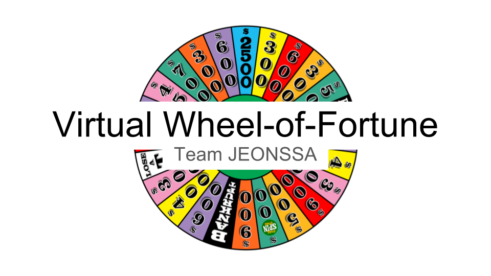
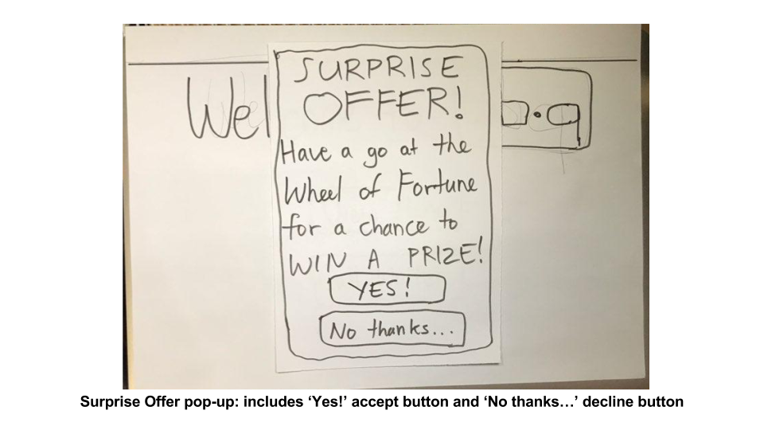
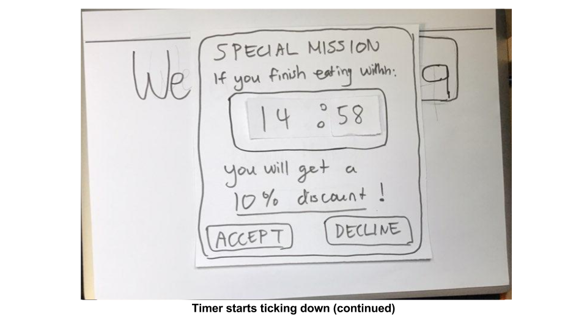
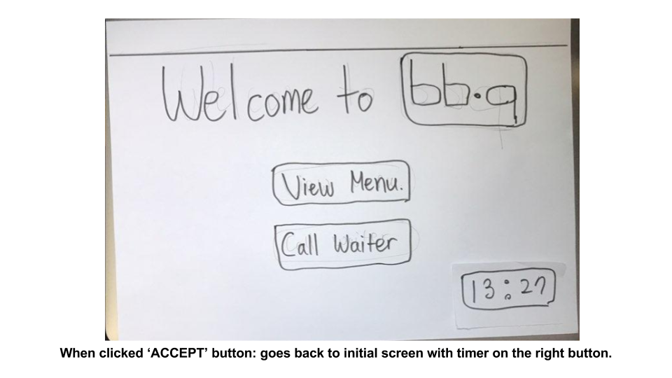

**CS374 Design Project 3: Paper Prototyping**  
**Team JEONSSA**  
20111016 Min Kang  
20121059 SunJae Lee  
20121061 Joon Young Lee  
20121087 Sewon Hong

---

# Paper Prototyping
 
 
---
## Prototype
### Initial Screen
 
 
 

### Surprise Offer Pop-up
 
##### Decline Offer
 
 
##### Accept Offer
###### Accept mission

###### Decline mission

---
## Participants

We presented our prototype to total three participants. 

###### KAIST undergraduate Student
* age: 23
* sex: male
* description: He is a KAIST undergraduate student who often goes out to eat with his girlfirend. Both he and his girlfriend is well known foodie, and has lots of experience waiting in a restaurant

###### KAIST SNU grad student
* age: 25
* sex: male
* description: He is a SNU graduate student who lives in very busy area around SNU. He hates waiting in a restaurant, and has has hard time finding restaurant that doesn't requires waiting.

###### OWNER of restaurant at Gangnam.
* age: 43
* sex: male
* description: He is a chief and a owner of a restaurant in a very busy area in Gangnam. He is very concerned about lossing potential users because of waiting time. 
---
## Briefing
  We presented a prototype of an interface of an touchscreen at a restaurant table, on which a prompt would show, notifying customers that they had a chance to win a special offer. The purpose of the presentation is to see whether the customer is willing to do certain tasks, such as eating faster, provided some incentive.

  The presentation was done after some micro-iteration with the feeback given by other peers in the class. The background behind this prototype is that direct request to eat faster can be intrusive. Direct request can undermine the overall dining experience. So we’ve tried to circumvent this potential intrusion by using the roulette, the wheel-of-fortune. Customer is expected to get the feeling as if they have done some work to get the incentive for their own good.
  
---
## Tasks
The users performed three main tasks: 
- clicking the accept button for the surprise offer, if they chose to try the roulette, or the dismiss button, should they have chosen not to accept
- spin the virtual roulette and get a reward (or possibly none) based on which category the wheel landed on, with the reward automatically taken into account (assuming the restaurant tracks customers and their orders by table)
- check the restaurant menu items and prices (and possibly order them directly from the interface?)

---
## Observation

Task | Observation
 --- | --- 
Accept/deny Roulette | * Too many pop-ups (P1)
Spin Roulette | Show roulette is spinnable (implemented) Change decision (implemented)
Check menu | Use better example (주문하기/상세보기)
Physical | Table space
Mental | Psychological pressure
 **Table 1.** Summary of observations
 
Spin Roulette
Include a prompt to show that the wheel is spinnable through touch interaction, otherwise might be hard to notice (implemented)
Include a prompt to make sure a user wants to confirm his/her actions when dismissing (to account for mistakes or change of mind)
Psychological pressure due to time count-down
Accept/deny Roulette
Too many pop-ups on a single screen
Physical
Tablet might take up too much space of the table
Check menu
In the BBQ menu example, it would have been nice to include interactions with 주문하기/상세보기 buttons or use a menu without 주문하기/상세보기

---
## Individual Reflection

#### SunJae Lee
* Observer
* It was very hard to just watch what user was doing. For example, ignoring user's questions was very awkward, and it was very tempting to correct user's mistakes in using our prototype.
* Paper prototype was very help in that it provided users with concrete design and functionality of part of our project, and thus we did not have to explain much about our project. Users did not have hard time realizing the purpose of the prototype.
* Our paper prototype did not cover how we manage waiting customers list. In this prototype, we rather focused on encouraing already sitted customers to eat faster for higher customer turnover ratio. 

#### Min Kang

#### Joon Young Lee

#### Sewon Hong
What role did you play in each round?
What were some of the difficulties you faced playing the role(s)?
In what way was paper prototyping useful in your project?
What did your paper prototype not cover or test?

---
## Studio Reflections
### FEEDBACK SUMMARY
1) Add more games besides virtual roulette.
2) Include other prizes besides discount.
3) Add elements from other storyboards into virtural roulette such as sharing table.

### FEEDBACK REFLECTION
1) In studio session, somebody recommended to add 브루마블 so that the games doesn't end instantaneously and user can accumulate prizes. However, since our goal is to reduce eating time, we want to keep the game simple so that it won't take long. Furthermore, providing mulitple prizes to a single customer could have a noticeable repercussion to the restaurant's profit. We might add games that are similar to roulette spinning, for example 사다리타기.
2) Our team does recognize that price of food is not the only feature of a restaurant that customers consider. Other features of a restaurant include mood, lighting, sanitization, interior design, desserts, and etc. Providing free desserts might be a plausible option, but this would lead to increase in eating time, which opposes to our goal. Hence, we thought price is the only feature that the restaurant could instantaneously change while reducing eating time. 
3) For DP3, we focused only on the storyboard that relates to current prototype. However we will include elements from other storyboards, such as table joining and recommending entertainment places, in future processes.
