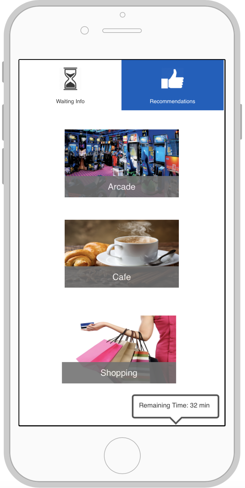
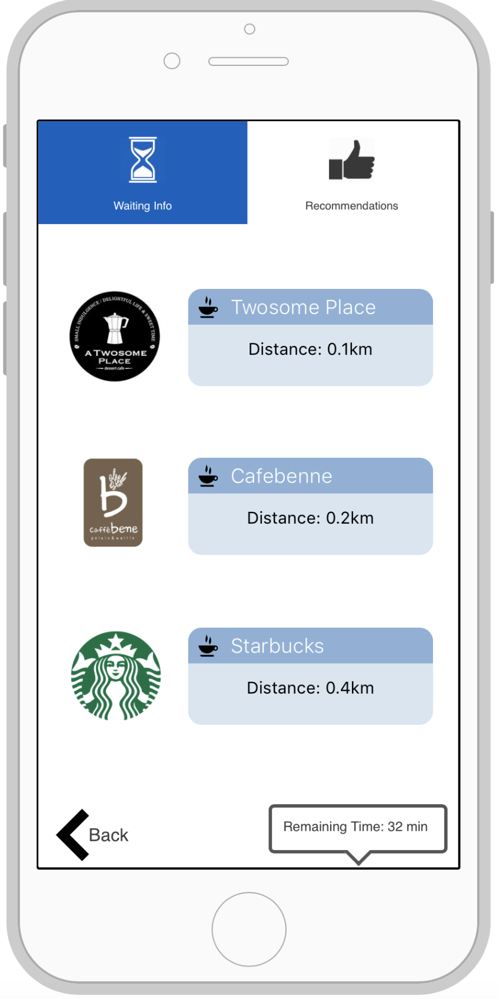
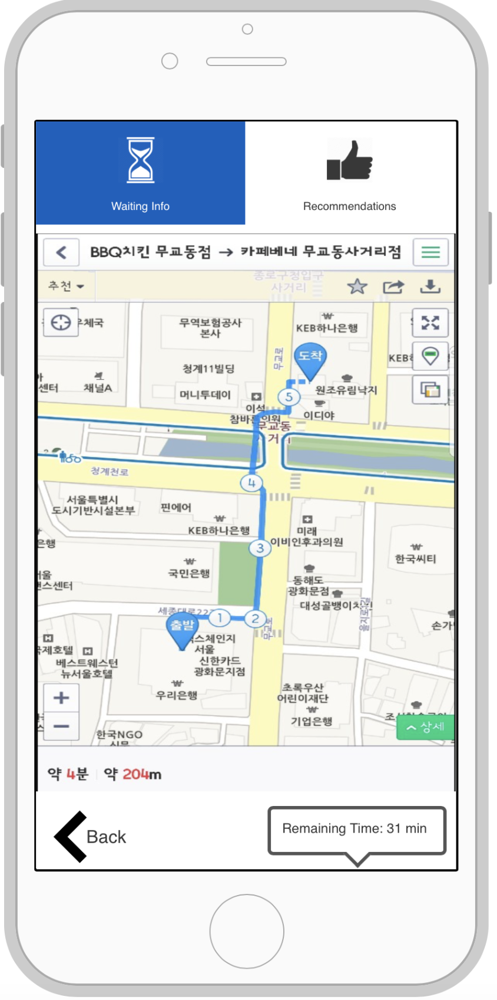

**CS374 Design Project 3: Lo-fi Prototyping**  
**Team JEONSSA**  
20111016 Min Kang  
20121059 SunJae Lee  
20121061 Joon Young Lee  
20121087 Sewon Hong

---

# Lo-fi Prototyping
 
 
---
## POV

We met several restaurant owners and potential customers who have experienced or have trouble with long waiting line at a busy restaurant. 
We were amazed that one out of two customers leave because of the long waiting, and that customers get very frustrated while waiting when they have to wait indefinitely in a very uncomfortable place. 
It would be game changing to reduce amount of time each customer has to wait, and to provide customers with estimated waiting time with possible resting place.

---
## Tasks

1. Surprise Offer

Customers are randomly propmted with a "Surprise Offer" message with an ipad (or any other portable device) at their table. Customer can choose whether to accept the offer or not. If the cusomer accepts, virtual roulette appears on the screen.  If the customer spins the roulette, he or she recieves a prize depending on which section of roulette it landed on. These sections include several discounts, coupons, and a challenge mission. To encourage fast eating, and give incentives to those who eat fast, in the challenge mission, customer is challenged to eat within a time limit. If the customer succeeds, he or she receives a prize, possibly a discount.

2. Enroll into waiting list

Customers can enroll themselves into a waiting list using an ipad (or any other portable device) at the front desk of the restaurant. On the main screen of the ipad, customers are provided with number of waiting teams, and estimated waiting time. Using this information, user can enroll themselves to waiting list by selecting desired waiting time, and typing in their phone number. 

3. Entertainment place recommendation & Estimated waiting time 

Once customers have registered into the waiting list, they will receive a text message that tells registration has been made successfully, and will provide a website link. The link directs customers to a web page that shows estimated real-time waiting time and remaining waiting team to give customers clear information about how long they should wait. Furthermore, the web page provides nearby entertainment places, sorted by criteria: Cafe, Arcade, and shopping with real-time map that can navigate customers to the particular entertainment place once customer selects the place.

---
## Prototype

---
## Participants

###### KAIST undergraduate Student (P1)
* age: 24
* sex: female
* description: She is a undergraduate student at Korea University who often goes out to eat with his boyfriend. She loves going to famous restaurant in seoul, but had to give up many times becuase of long waiting time.
###### Owner of restaurant at Dunsan (P2)
* age: 32
* sex: male
* description: He is a restaurant owner at Dunsan, Daejeon. He runs a famous restaurant that always has waiting customers. 

###### Office worker (P3)
* age: 30
* sex: male
* description: He is a office worker who lives at Gangnam. He always wanted to go dine at a particular restaurant in Gangnam with his family, but couldn't because his wife hates waiting.

---
## Observation

Task | Observation
 --- | --- 
Surprise Offer | 1. Customer might feel that they get disadvantage when they fail the challenge (P2, high) 2. Customer might miss the surprise offer if there is no effective alert (P1, high) 3. Discount rates are too high (P2, low)  4. Wish there are other options not related to direct discount, for example offering cheap free drinks (P1, medium)
Enroll into waiting list | 5. 
Estimating Waiting time | 6. Wish there is a "view all" button to see all the recommended places at once (P2, P3, medium)  7. Wish the map shows all places, not just the selected one (P1, P3, medium)  8. I wish there are more options other than arcade center, cafe, and shopping. An example might be coin karaoke places. (P3, medium)  9. Wish there was a stronger alarm that tells user how much time left in case user is not looking at phone (P1, P3, high)  10. What is the correlationship between teams remaining and time remaining? 5minutes per team? 10minutes per team? (P1, P3, high)

### Plans for Improvement (order corresponds to the list in table)

---
## Paper vs Digital
 
---
## Studio Reflections

### FEEDBACK SUMMARY
1. Pop-up messages are overlapped so it seems a little bit noisy
2. Add some confirmation when you decide to accept a challenge
3. When calling a waiter, show some animation or status or time left for user can save time for unnecessary condition.

### FEEDBACK REFLECTION

