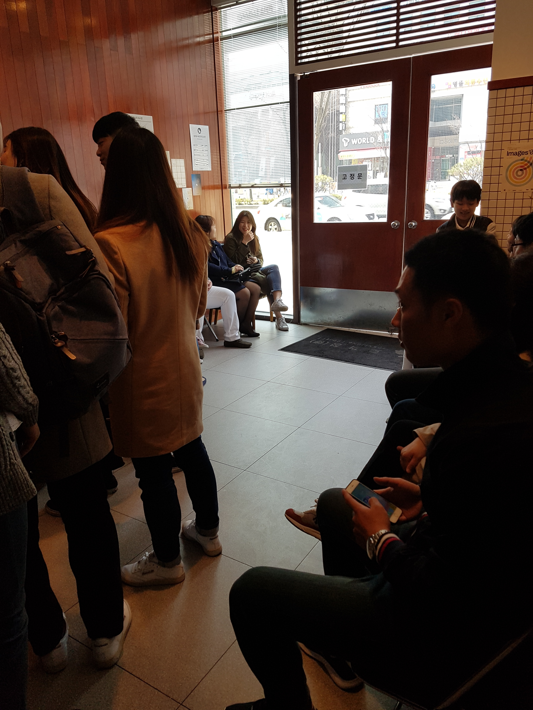
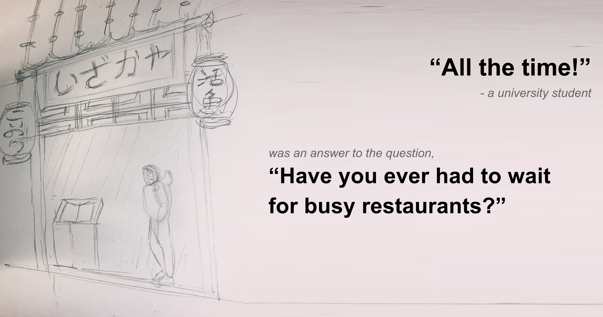
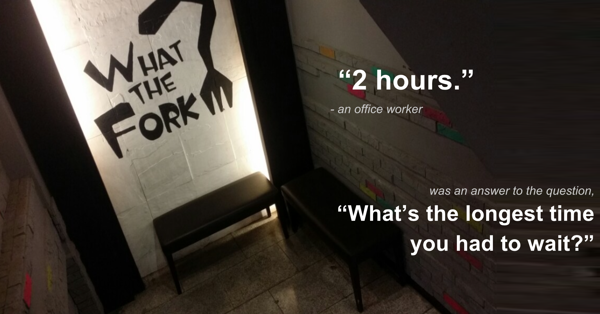

**CS374 Design Project 1: Needfinding**  
**Team jeonssa**  
20111016 Min Kang  
20121059 SunJae Lee  
20121061 Joon Young Lee  
20121087 Sewon Hong

 

---

# Say Goodbye to Tiresome Waiting!
## Experience
Redesign how potential customers have to wait for seats in full restaurants during peak hours in busy areas.  
(such as 강남 or 둔산)  

**Figure 1.** People waiting in a restaurant during lunch time.
 
 
 ## Observations & Interviews
 ### Summary
 **Table 1.** Summary of interviews conducted.  
 
 Interviewee | Interviewer | Why chosen? | How? | Where? | What did we ask?
 --- | --- | --- | --- | --- | ---
 University student | Min | Lots of experience dining at busy places | Friend| 강남 일식집 |Waiting experience
Restaurant Owner | SunJae | Has hard time managing customer waiting list | Ate at his restaurant| 은행동 스테이크집 |Dealing with waiting customers 
 University student | Joon Young | Foodie (맛집러) | Girlfriend| 둔산 일식집 |Waiting experience
Office worker | Sewon | Lots of experience dining at busy places | Offline interview| 숙대입구 카페 |Waiting experience

**OBSERVATION #1: “I don’t like waiting.”**

**Figure 2.** People don’t like waiting.
 

A university student was asked about the recent waiting experience in restaurants. He has had lots of dining experiences at busy places and hence was qualified as a “story-teller” of the experience we were trying to redesign. He insinuated a little frustration as he shouted “All the time!” when asked if he ever had to wait in restaurants. This confirms one statement: People don’t like waiting. [Here are the full notes taken from this interview.](#interview1)

**OBSERVATION #2: “Making customers wait is bad."**

**Figure 3.** Making customers wait is bad.
 

 We gently asked the restaurant manager for 2 minutes. He would give a valuable lesson about our redesigning experience as he had arbitrated a lot of waiting customers. He showed a wry smile when he said “One out of two tends to leave at busy hours”. This informs us one thing. Making customers wait is bad for restaurants too. [Here are the full notes taken from this interview.](#interview2)

**OBSERVATION #3: “I am willing to wait if you let me know until when.”**

**Figure 4.** Letting know  expected waiting time is good.
 

A young female pulled out a “waiting ticket” as the interview began. A self-proclaimed “foodie”, she had some interesting aspects to reveal regarding the experience we were planning to redesign. She decided to stay and wait in the restaurant after looking at the ticket written “대기인원: 1명”. This enlightened us with one thing: Letting know until when to wait is good. [Here are the full notes taken from this interview.](#interview3)

**OBSERVATION #4: “Causes unproductivity”**

**Figure 5. Valuable time is lost.**
 

Working in Gangnam, the two office workers could be the extreme users of our to-be-redesigned experience. They wait almost everyday but did not have a clear plan what to do while waiting. One surprising answer was "2 hours" to the question "What was the longest time of waiting?" We now know that waiting can cause unproductivity for some people. [Here are the full notes taken from this interview.](#interview4)

## Interesting Moments
From the interview, we observed some interesting moments and problems that they face.

For customers,  
* They have hard time estimating when their table will be ready.
* They do not want to jus tsit and wait for their turns.
* When the kitchen is too busy, they still had to wait for a long time, albeit while sitting
* They are willing to wait for a long time for a particular restaurants
* They are sensitive about giving out their personal information to the restaurant.

For restaurant owners,
* They get very frustrated when customer, for some reason (e.g. too shy), do not notify the restaurant when they want to cancel the reservation.

## Needs
From the problems and interesting moments found above, we derived following needs for our interviewees.

For customer, they want to ...
* Be notified when their turns has come.
* Know how longer they have to wait.
* Be notified at an appropriate time. (e.g. "Seat be ready in 5 minutes")
* Get started eating as quickly as possible.
* Do something entertaining while waiting (e.g. shopping, go to cafe)
* Not provide too much personal information (e.g. phone number, name)

For restaurant owners, they want to ...
* Know when customers wants to cancel the reservation

Apart from the interesting moments listed above, through further brainstorming and interview, we derived following needs that our potential users face.

For customers, they want to ...
* Stay comfortable while waiting (e.g. avoid heat during summer, chill during winter)
* Not have to keep piece of paper with themselves all the time (paper ticket)

For restaurant owners, they want to
* Minimize the amount of labor required for managing waiting customers.
* Accommodate as many customers as possible.
* Be able to accurately estimate the expected waiting time for customers.

## Insights
From the above-mentioned interesting moments and problems, we also derived insights.

* Letting the customer know the expected waiting time increases the chance of holding the customer.
* Uncertain estimation of eating time leads to providing uncertain expected waiting time to customers.
* Clerk may find it difficult to estimate when the seats will become empty, thus hard to tell customers how many minutes are left.
* Current process of being seated is wasteful - clerk tells you there’s an empty seat→ get seated→ look at the menu→ calls the clerk→ order menu.
* People are more inclined to wait for restaurants that have a waiting list system, for which they are free to do other things during the waiting time.
* Customers want to provide minimal personal information.
* People are more inclined to wait for restaurants that they like/know, rather than for ones they haven’t been to before.
* Customers need a strong alarm that will draw attention while doing something else outside the restaurant.

Apart from the interesting moments listed above, through further brainstorming and interview, we derived following insights.

* People are foced to wait in the same area with strangers, feeling awkward
* Having a waiting list system is preferable in general; 
without a strict order, conflict may occur between waiting customers
* Although some restaurants have allocated areas where waiting customers can stay, 
many restaurants lack such space, which makes it hard for potential customers to wait

## Interviews

###  Interview. 1 (University Student 1)

**Q:** When you have to wait for a restaurant, do you wait it out, or look for others?

**A:** Depends on the restaurant, but usually wait it out

**Q:** How long are you willing to wait for a restaurant that you want to go to?

**A:** Up to 30 minutes

**Q:** Have you had to frequently wait for busy restaurants?

**A:** All the time

**Q:** After put on a waiting list (for restaurants that have implemented one), are you free to spend the waiting time doing something else? If yes, then how are you notified once a table is free?

**A:** Yes – they call me on my mobile.

**Q:** Would you be willing to visit a site (web app) that manages your waiting time for restaurants?

**A:** I would be interested.

###  Interview. 2 (Restaurant Owner)

**Q:** When is the busiest time?

**A:** Our restaurant is usually full during weekend 6 p.m ~ 7 p.m

**Q:** Is there customers who wait because there’s no seat remaining?

**A:** There are plenty of customers who waits during the busy hours.

**Q:** Where do customers wait?

**A:** Since there aren’t much place to wait, customers usually wait at the back of the restaurant or at the stairs outside the restaurant.

**Q:** Is there customers who leave because they can’t wait?

**A:** One out of Two groups leaves.

**Q:** Is there any solutions you have come up with to solve this problem?

**A:** I have tried making a number ticket, take customers’ phone number, and call them by the
time their seat is ready.

**Q:** Did those solutions work?

**A:** It was really hard to call each customers during the busy hour. Also, some customers didn’t want to give their number, and some didn’t accept the call.

###  Interview. 3 (University Student 2)

**Q:** How often do you visit a busy restaurant that you have wait in line?

**A:** Not so much in Daejon, but when I lived in Seoul I looked up lots of 맛집s and had to wait almost every time

**Q:** What do you do while waiting?

**A:** Walk around near the restaurant. Feels boring to just seat and wait

**Q:** How did the clerk keep track of waiting customers in order?

**A:** By giving out waiting number tickets, or making the customers write down their name&phone number, then call when my turn comes close

**Q:** Do you have a suggestion for how to spend waiting time?

**A:** It would be nice to have an app that tells you what entertainment places are out there near the restaurant

**Q:** Would you use a service that tells you estimated time left online?

**A:** Yes. Gong Cha already provides a service that you order online and pick it up when it’s done.

###  Interview. 4 (Office Workers)

#### Worker 1

**Q:** How often do you experience no-seat?

**A:** 일주일에 한번?

**Q:** What are your feelings when there are no seats available in the restaurant you really want to go?

**A:** 짜증났다.

**Q:** What's the longest time you waited?

**A:** 2시간 정도

**Q:** What did you do during waiting?

**A:** 번호표 뽑은다음에 따른데 가있었음 카페나 피시방에.

**Q:** 자기 차례인 어떻게 알앗죠? 

**A:** 감. 몇분정도 걸릴건지 안알려주니까, 한번은 놓친적도 있어요. 놓치면 리셋되서 포기하고 딴거먹음

**Q:** Why did you decide to wait? or not to wait?

**A:** 남는 사람의 수랑 음식점이 진짜 마음에 드는지

**Q:** Do you like or not like the waiting experience?

**A:** 나쁜경험 

**Q:** What did restaurant do to manage waiting customers?

**A:** 번호표나 줄서라고 관리한다.문자로 알려주는 곳도 있었따 (번호 적으라고)

#### Worker 2

**Q:** When you have to wait for a restaurant, do you wait it out, or look for others?

**A:** Depends on the restaurant, but usually wait it out

**Q:** How long are you willing to wait for a restaurant that you want to go to?

**A:** Up to 30 minutes

**Q:** Have you had to frequently wait for busy restaurants?

**A:** All the time

**Q:** After put on a waiting list (for restaurants that have implemented one), are you free to spend the waiting time doing something else? If yes, then how are you notified once a table is free?

**A:** Yes – they call me on my mobile.

**Q:** Would you be willing to visit a site (web app) that manages your waiting time for restaurants?

**A:** I would be interested.

**Q:** How often do you experience no-seat?

**A:** 주 2회. 강남쪽

**Q:** What are your feelings when there are no seats available in the restaurant you really want to go?

**A:** 인기가 많구나. 맛있겟다.

**Q:** What's the longest time you waited?

**A:** 2시간 쯤.

**Q:** What did you do during waiting?

**A:** 앉아있었요. 식당 바깥에 공원 같은데서. 친구랑 이야기 하거나. 지루했다

**Q:** Why did you decide to wait? or not to wait?

**A:** 되게 유명한 집이어서 먹어보고 싶어서

**Q:** Did you ever left the restaurant 

**A:** 있읍니다. 시간 적인 여유가 없어서

**Q:** Do you like or not like the waiting experience?

**A:** 괜찮았어요. 

**Q:** Why? 

**A:** 먹고싶었던 음식을 기다려서 먹는거니까
